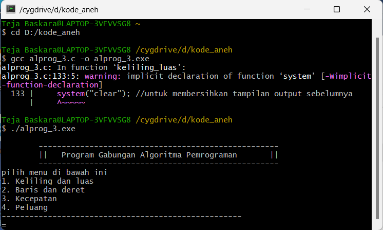

# Tugas-Alprog

Tugas alprog untuk mengubah kode yang kita buat menjadi sebuah fungsi dan disatukan dalam satu program
adapaun output yang dikeluarkan oleh program ini sebagai berikut 

(./screenshot/contoh 2.png)
(./screenshot/contoh 3.png)
(./screenshot/contoh 4.png)
(./screenshot/contoh 5.png)
